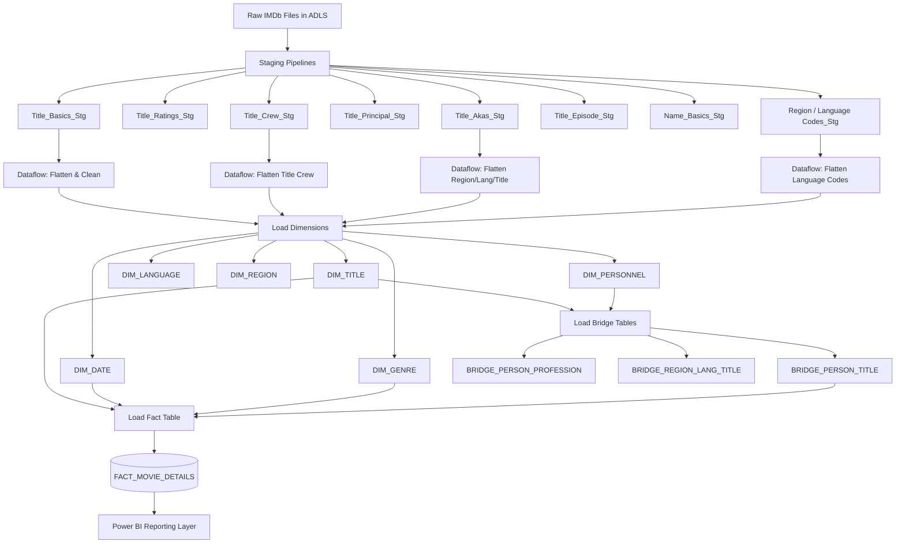
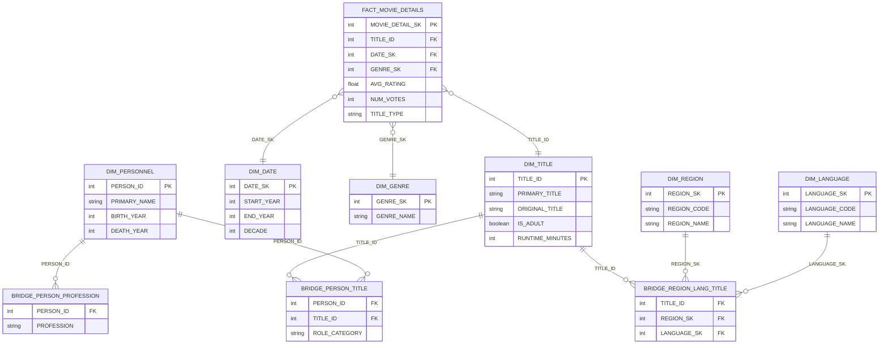
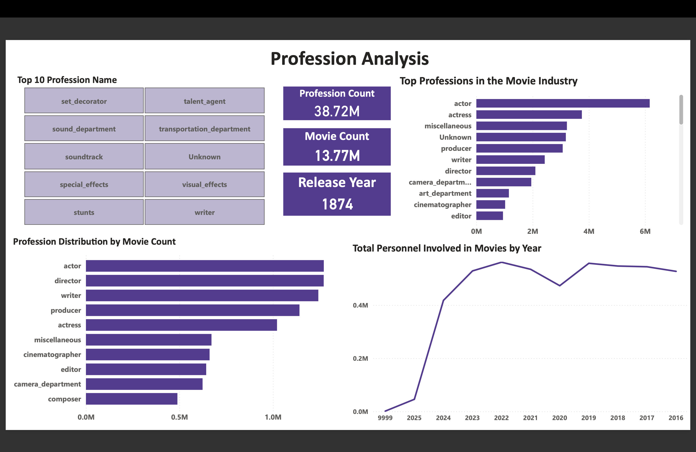
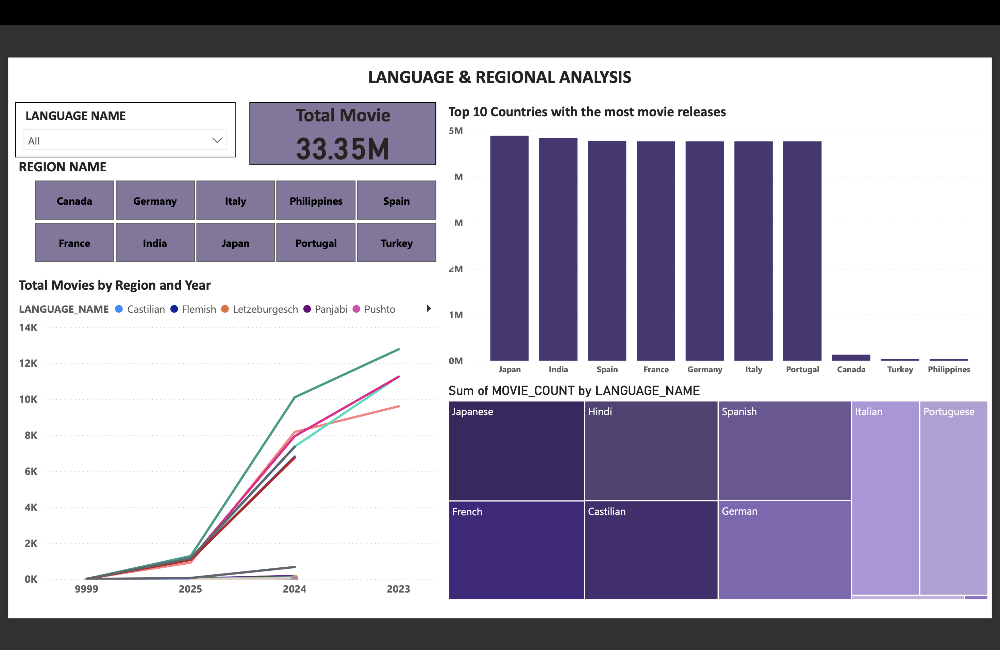
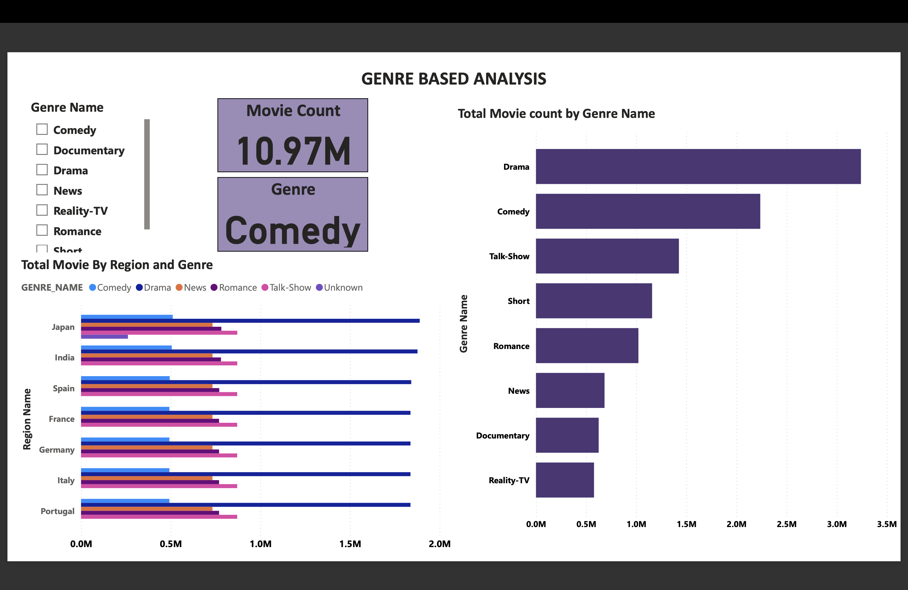
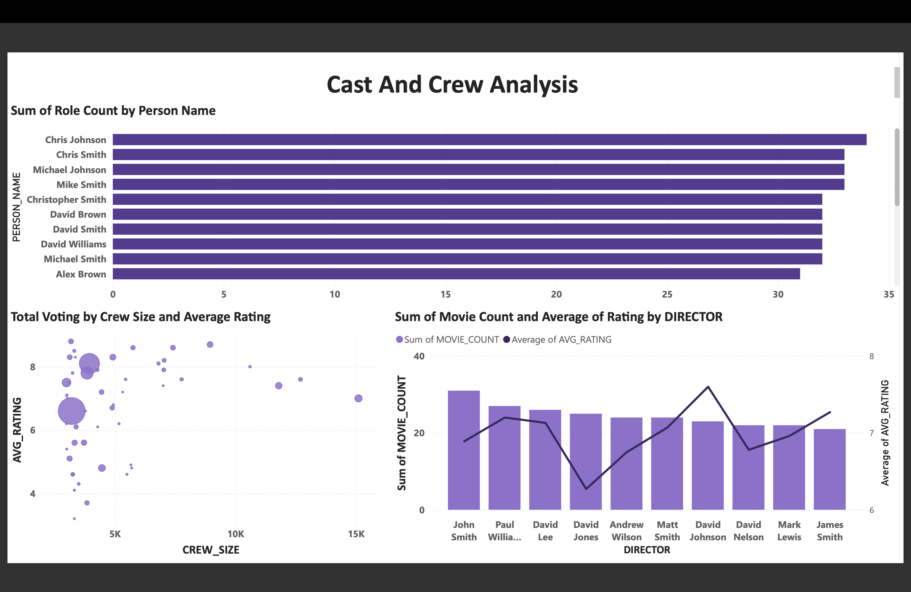
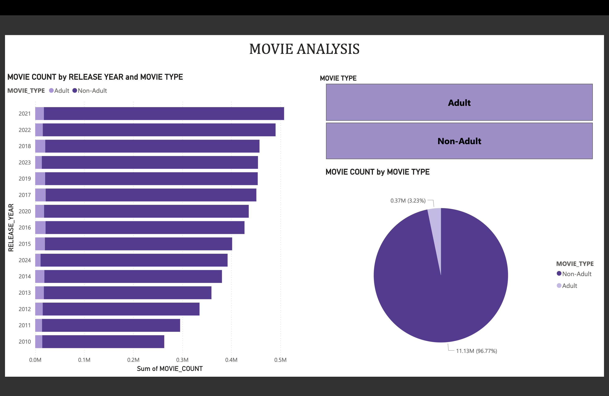

# 🎬 IMDb — Azure Data Pipeline & Analytics

A production-style, cloud-based data pipeline that ingests, cleans, models, and visualizes **50M+ IMDb records** using **Azure Data Factory**, **Snowflake**, and **Power BI**, built on **Medallion Architecture**.

---

## Objective

Extract, clean, and model IMDb's public datasets to answer real business/analytics questions:

- Movie genre and rating trends
- Cast & crew profession breakdowns
- Region and language-based release patterns
- Series vs. non-series popularity
- Top-rated titles and character-level insights

---

## Tech Stack

| Category | Tools |
|---|---|
| Ingestion / ETL | Azure Data Factory (ADF), Alteryx |
| Data Warehouse | Snowflake |
| Data Modeling | ER Studio (Star Schema) |
| Profiling | ydata-profiling, Alteryx |
| BI / Reporting | Power BI |
| Architecture | Medallion (Bronze → Silver → Gold) |
| Version Control | Git & GitHub |

---

## Medallion Architecture

```mermaid
flowchart LR
    subgraph Source["IMDb Public Datasets (.tsv.gz)"]
        S1[name.basics – 14M+]
        S2[title.akas – 51M+]
        S3[title.crew – 11M+]
        S4[title.basics – 11M+]
        S5[title.episode – 8.8M+]
        S6[title.principals – 90M+]
        S7[title.ratings – 1.5M+]
    end

    subgraph Bronze[" Bronze - Raw Ingestion"]
        B1[(ADLS / Blob Storage
        Raw Landing Zone)]
    end

    subgraph Silver[" Silver - Cleaned & Staged"]
        SV1[Alteryx: Profiling & Cleansing]
        SV2[ADF Pipelines: Flatten, Stage,
        Standardize Schemas]
        SV3[(Snowflake Staging Tables)]
    end

    subgraph Gold[" Gold - Modeled for BI"]
        G1[(Star Schema:
        Dimensions + Fact + Bridges)]
    end

    R1[Power BI Dashboards]

    Source --> B1
    B1 --> SV1 --> SV2 --> SV3
    SV3 --> G1
    G1 --> R1
```



---

## Azure Data Factory Pipeline Flow



---

##  Star Schema (Snowflake Data Model)



> **Why bridge tables?** IMDb relationships aren't strictly one-to-many a title can have many cast/crew members and release in many region/language combinations, and a person can have multiple professions. Bridge tables handle these many-to-many relationships cleanly within the star schema.

---

##  Repository Structure

```
IMDB---Azure-Data-Pipeline-and-Analytics/
│
├── IMDB_AMS_DADABI-main/           # Azure Data Factory export
│   ├── factory/                   # ADF factory definition
│   ├── pipeline/                  # Staging & load pipelines (per entity)
│   ├── dataflow/                  # Mapping data flows (flatten, bridge, dim loads)
│   ├── dataset/                   # Source/sink dataset definitions
│   └── linkedService/             # Connections (ADLS, Blob, Snowflake, Key Vault)
│
├── CLEANING/                       # Alteryx cleaning workflows (.yxmd) + cleaning report
├── PROFILING/                      # ydata-profiling reports (HTML/PDF) per entity
├── PowerBI_Dashboards/              # Exported dashboard PDFs
├── images/                         # Dashboard screenshots
├── Mapping_Midterm.xlsx            # Source-to-target mapping document
└── README.md
```

---

##  Pipeline Steps

1. **Ingest** — Raw IMDb `.tsv.gz` files land in Azure Data Lake Storage (Bronze layer).
2. **Profile** — Run `ydata-profiling` and Alteryx profiling on each entity (titles, names, ratings, crew, episodes, akas, region/language codes) to catch nulls, duplicates, and type issues.
3. **Clean (Alteryx)** — Dedicated `.yxmd` workflows clean and standardize each dataset before staging.
4. **Stage & Transform (ADF)** — Per-entity staging pipelines load data into Snowflake staging tables; Mapping Data Flows flatten nested/array fields (e.g. multiple genres, languages, professions per row) and standardize schemas per the source-to-target mapping document.
5. **Model (Gold layer)** — Load dimension tables, bridge tables (for many-to-many relationships), and the central `FACT_MOVIE_DETAILS` table into Snowflake using a star schema.
6. **Report** — Power BI connects to the Gold layer to power interactive dashboards with slicers/filters for business users.

---

##  Sample Dashboards

Dashboards built in **Power BI**, covering genre/rating trends, top-rated titles, cast & crew profession breakdowns, and region/language release patterns.







---

##  Future Improvements

- Move Snowflake credentials to Azure Key Vault–backed linked services everywhere (partially in place already)
- Add pipeline-level monitoring/alerting in ADF
- Automate incremental loads instead of full staging reloads
- Add CI/CD for ADF pipeline deployment across environments
